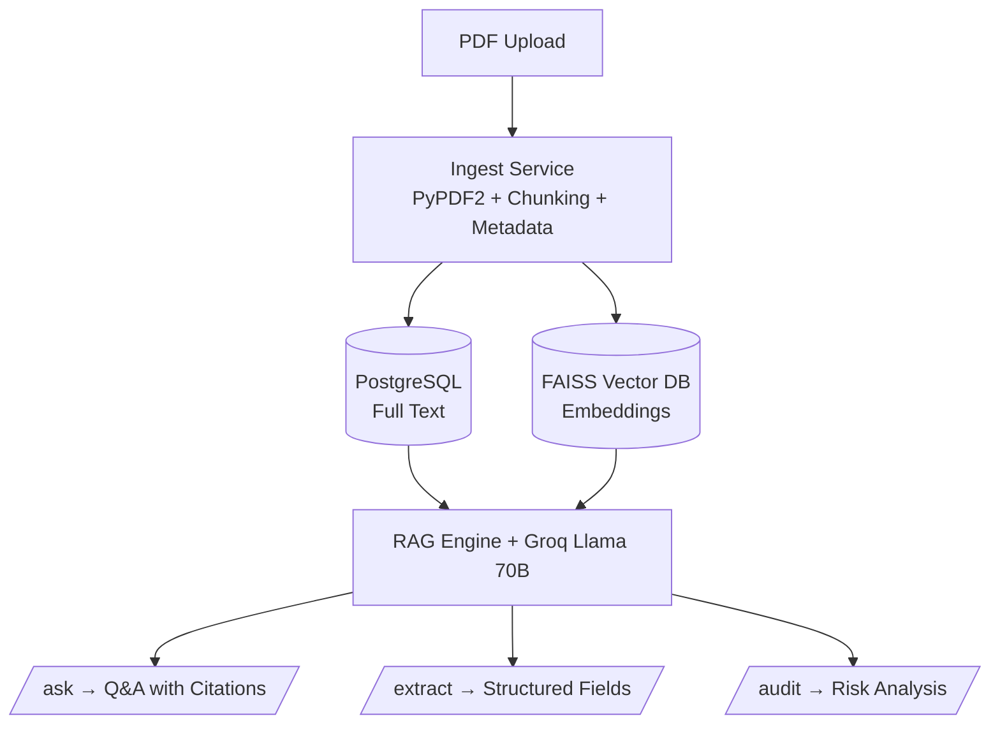

# 🚀 Contract Intelligence RAG System

A production-ready **LLM-powered Contract Intelligence System** built using:

- **FastAPI** (Backend Framework)
- **FAISS** (Vector Database)
- **HuggingFace Embeddings** (`intfloat/multilingual-e5-base`)
- **Groq Llama-3.3-70B** (LLM for Q&A, Extraction, Audit)
- **PostgreSQL** (Document Storage)
- **PyPDF2** (PDF Text Extraction)

This system supports:

✅ Contract **Ingestion**  
✅ Contract **Information Extraction** (structured fields)  
✅ **RAG-based Question Answering** with citations  
✅ Contract **Risk Auditing** (clause severity, evidence, remediation)  
✅ **SSE Streaming** for real-time answers  
✅ **Admin Metrics + Health Check**

---
## 🧱 Architecture Overview



---

# 🛠 Tech Stack

| Component | Technology |
|----------|------------|
| Backend | FastAPI |
| LLM | Groq Llama-3.3-70B |
| Embeddings | intfloat/multilingual-e5-base |
| Vector DB | FAISS |
| Database | PostgreSQL |
| PDF Parsing | PyPDF2 |
| Streaming | SSE (Server-Sent Events) |

---

# 📦 Project Setup

## 1. Clone Repo

```bash
[git clone https://github.com/sachinbareth/Conntract_RAG.git]
cd contract-intelligence
```

## 📦 Setup Instructions

### 1️⃣ Create Virtual Environment
```bash
python -m venv .venv
source .venv/bin/activate    # Mac/Linux
.venv\Scripts\activate       # Windows


2️⃣ Install Dependencies
pip install -r requirements.txt

3️⃣ PostgreSQL Setup
CREATE DATABASE contractdb;

4️⃣ Create .env
POSTGRES_URL=postgresql://postgres:<password>@localhost:5432/contractdb
GROQ_API_KEY=xxxxxxxxxxxxxxxxxxxx


▶️ Run Server
uvicorn app.main:app --reload

```

## 🐳 Docker Setup

### 🔹 Build Image
```bash
docker build -t contract-intel .
```

### 🔹 Run Container
```bash
docker run -p 8000:8000 --env-file .env contract-intel
```
### 📂 Project Structure
```bash
app/
│── api/
│   ├── ingest.py
│   ├── ask.py
│   ├── extract.py
│   ├── audit.py
│   └── admin.py
│
│── services/
│   ├── rag_engine.py
│   ├── text_splitter.py
│   ├── llm_extractor.py
│
│── db/
│   ├── connection.py
│   ├── models.py
│   └── crud.py
│
│── main.py
│── config.py
```


